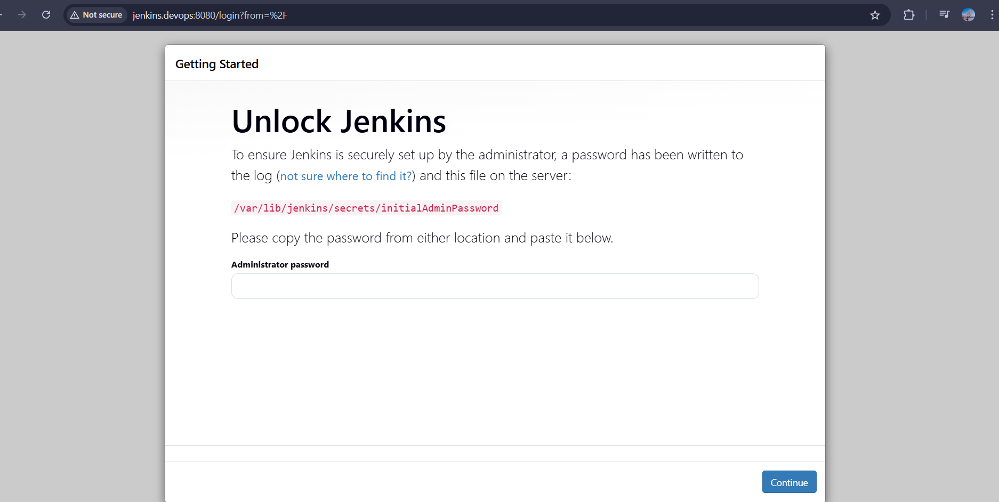
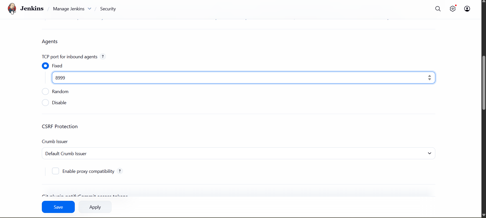
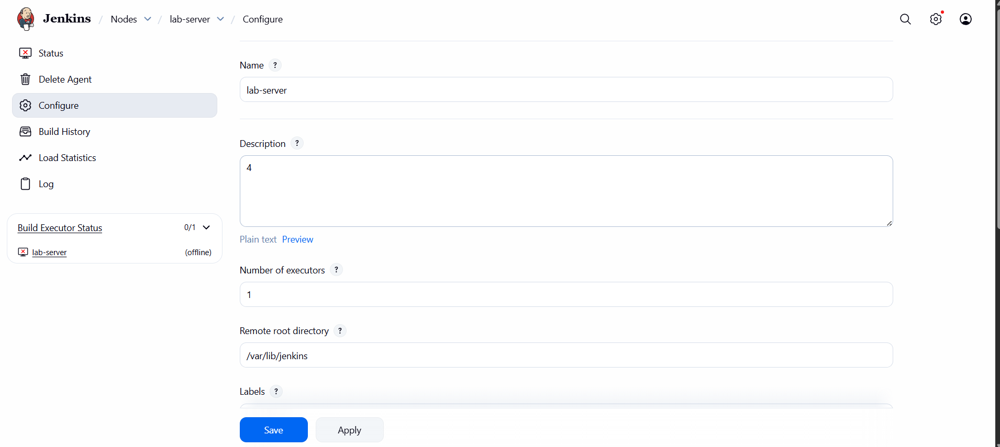
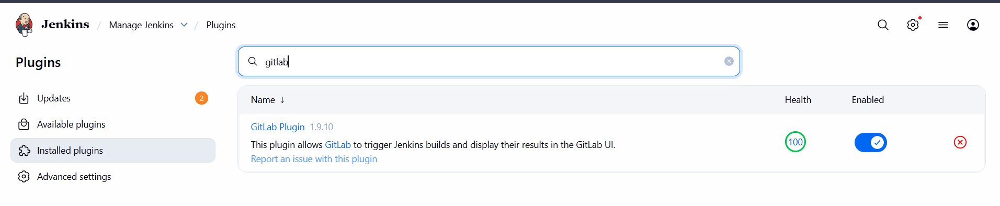
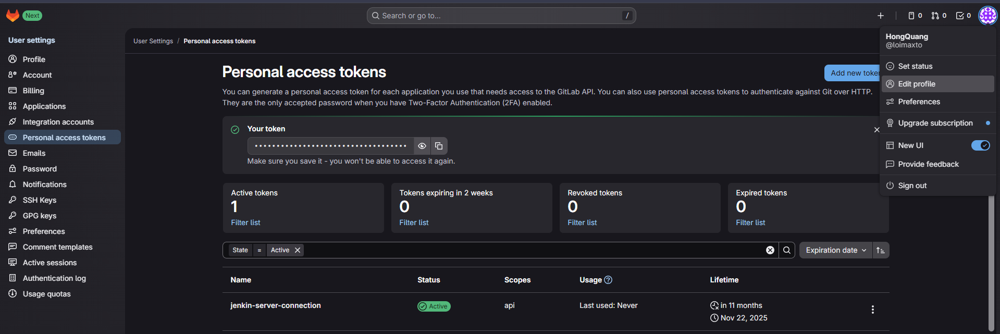
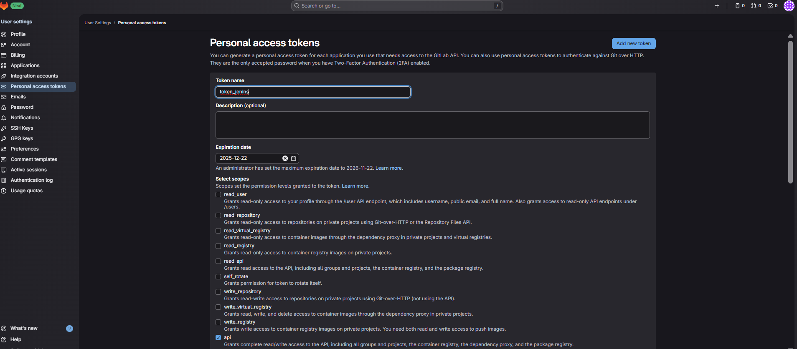
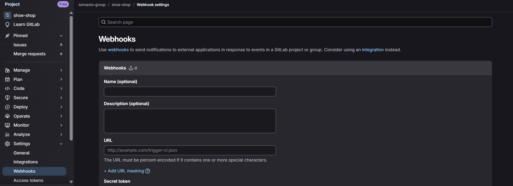

# Objective

In the lesson, I will document how to setup Jenkin on a virtual machine.
# Summary

1. Install Jenkins
2. Connect Jenkin agent on the server that need to deploy projects to Jenkin server
3. Connect Jenkin serverz to Gitlab
	1. Using Gitlab plugins.
		1. System -> Gitlab
4. Config pipeline
5. Connect Gitlab webhook to Jenkins
6. Jenkins file
7. Create pipeline stages
	
# Setup

## 1 Premise
#### Install Jenkins file

```sh
#!/bin/bash
apt install openjdk-17-jdk openjdk-17-jre -y
java --version
wget -p -O - https://pkg.jenkins.io/debian/jenkins.io.key | apt-key add -
sh -c 'echo deb http://pkg.jenkins.io/debian-stable binary/ > /etc/apt/sources.list.d/jenkins.list'
apt-key adv --keyserver keyserver.ubuntu.com --recv-keys 5BA31D57EF5975CA
apt-get update
apt install jenkins -y
systemctl start jenkins
systemctl enable
ufw allow 8080
```

#### Setup host name server
[1 Files system](../../Linux/1%20Files%20system.md)
On VMware linux
```
vi /etc/hosts
192.168.192.98 jenkins.devops
```

On Window

edit this file C:\Windows\System32\drivers\etc\hotst .file

```txt
add this line
# Jenkins
192.168.192.98 jenkins.devops
```

=> this setting will allow window uses domain name "jenkins.devops" to access application run on VMware 

**Reverse proxy**

using nginx to mapp "jenkins.devops:8080" -> "jenkins.devops"
install nginx

```bash
apt install nginx -y
cd /etc/nginx
vi conf.d/jenkins.devops.conf
```

nginx config
```txt
server {
    listen 80;

    server_name jenkins.devops;

    location / {
        proxy_pass http://jenkins.devops:8080;

        proxy_http_version 1.1;

        proxy_set_header Upgrade $http_upgrade;

        proxy_set_header Connection keep-alive;

        proxy_set_header Host $host;

        proxy_cache_bypass $http_upgrade;

        proxy_set_header X-Forwarded-For $proxy_add_x_forwarded_for;

        proxy_set_header X-Forwarded-Proto $scheme;
    }
}
```

then apply config
```
nginx -t // test correct syntax
nginx -s reload
```

#### Result after setup finish


Then open the file that stores jenkins password add key into input , start to setup default plugins
### Jenkin components

security
plugins
agents : add server 
credentials: secretes
jenkins cli : automaction code
system log

#### Jave version
```
apt install openjdk-11-jdk -y
update-alternatives --config java // choose default java version
```

## 2 Jenkins container

```bash
docker run -p 8080:8080 -p 5000:5000 -d \
-v jenkins_home:/var/jenkins_home jenkins/jenkins:lts
```

###  Config Docker for Jenkins container
This setting will allow current container using host docker ( Must mount docker.dock to container )
```bash
docker run -p 8080:8080 -p 5000:5000 -d \
-v jenkins_home:/var/jenkins_home \ # existed volume
-v /var/run/docker.sock:/var/run/docker.sock \ # mount docker command available in container
jenkins/jenkins/lts

###login as root
## enter as root user in container 
docker exec -u 0 -it <name> bash
curl https://get.docker.com > dockerinstall && chmod 777 dockerinstall && ./dockerinstall

## allow run docker by using jenkins user inside container
ls -l /var/run/docker.sock
chmod 666 /var/run/docker.sock # allow other users inside container to use
```

# Jenkins agent

#### Setup security
This code config a port for Jenkins server to use


### Create agent

open Manga Jenkins -> Nodes( new node) -> create Jenkins agent



After creating, it shows this UI instruction to connect Jenkin agent with 
```bash
echo <secret_key> > secret-file
curl -sO http://jenkins.devops:8080/jnlpJars/agent.jar
java -jar agent.jar -url http://jenkins.devops:8080/ -secret @secret-file -name "lab-server" -webSocket -workDir "/var/lib/jenkins" > nohup.out 2>&1 &

```

But I met problem that although I can ping by using ip address, but it doesn't recognize hostname. It happens because I use NAT gateway for VMware  server,

# Connect Gitlab - Jenkins
## 1 Install Gitlab and Blue Ocean plugins



## 2 Create access gitlab access token

Follow these steps:
Account -> Edit Profile -> Personal access token ->button Add new access token



Tick "api" checkbox then save

## 3 Add Gitlab access token to Jenkins
Go to :
Manage Jenkins -> System -> scroll to "Gitlab(credential)" -> Add


##  4 Create folder - action pipeline
creat action item


create pipelinei for shoeshop


Config pipeline
Find and tick these checkbox:
- General - Preserve stashes ( history pipeline)
- Trigger - Build when a change is push to Gitlab
- Pipeline - Add repo url and credential(user-pass) for authorize Gitlab
-> Save
## 5 Web hook Gitlab
### a) Gitlab side

> This is use only when your Jenkins server have been public (not use in private network)

Enter : Project -> Setting -> Web Hook



Url syntax
```
http://<jenkins-user>:<user-token>@<jenkins-address>/project/<jenkins-project-url>

#jenkins-address must be able to connect( use LAN network with VMware)
# 
```

> Tick "Allow requests to local network from web hook and services."


#### Public localhost domain
Because I don't host gitlab on a gitlab server but using gitlab provider. So I have to public my Jenkins server as a public url allow Gitlab to use it for web hook
first
> using localhost.run

```bash
 ssh -R 80:192.168.192.98:8080 localhost.run
 <host-port>:<vmware server ip>:<vmware server port> localhost.run
```


**Static domain**
npm install -g localtunnel
$$\text{lt --port 8080 --subdomain your-static-name}$$
### b) Jenkins side

