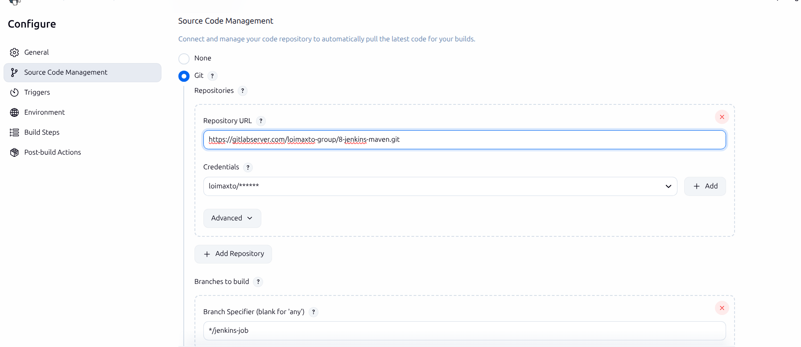
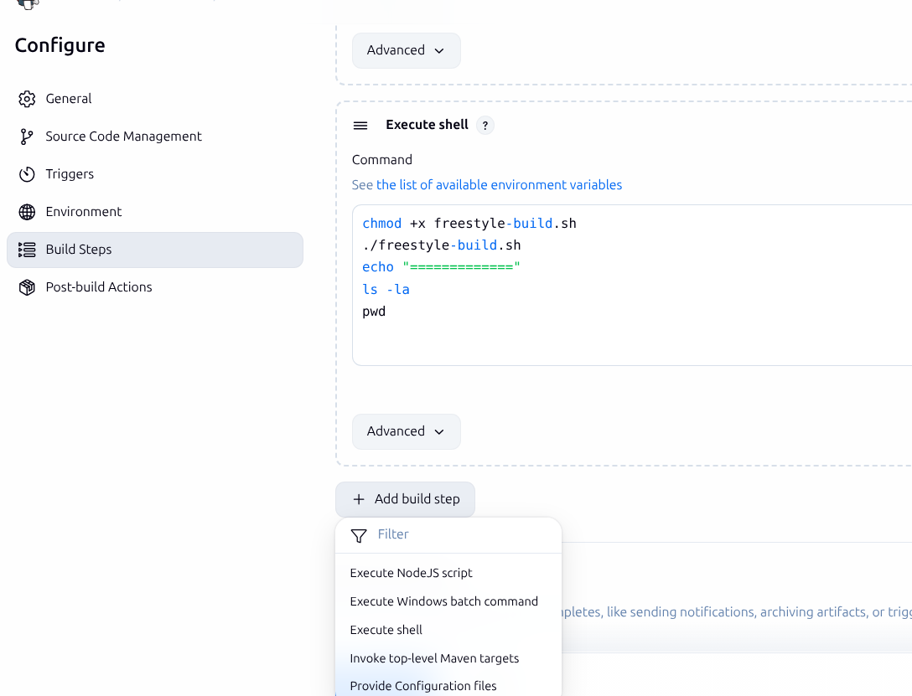
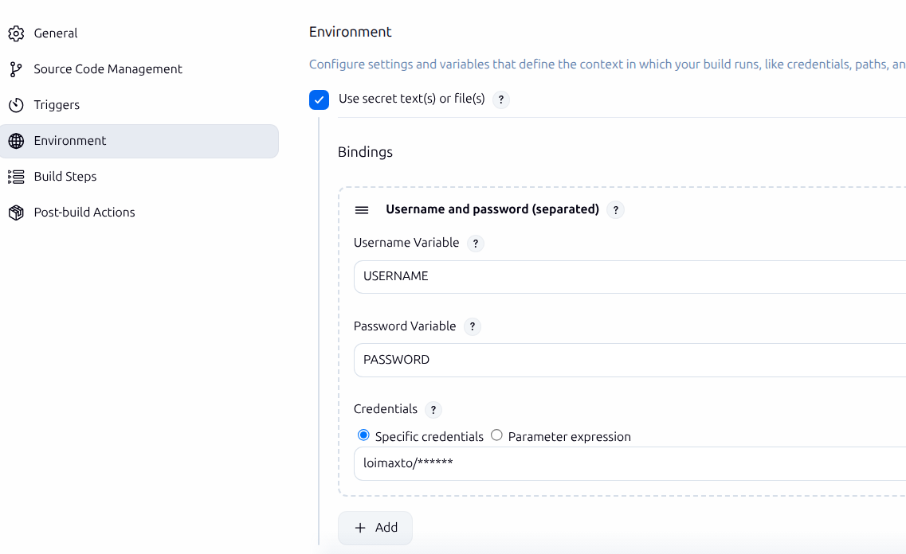

## Summarize
In this instruction, I will
- Create Jenkins job
- Create Jenkins credential for Gitlab
- Build create

##  Create Jenkins job

#### 1 Freestyle job
1. Create jobs
2. Config job

**Add Git repo to Jenkins**


**Add build step**

### 2 Setup build tools and plugins

> [!tip] Install build tools directly in container
> Must login container as root user so build tool can be used globally

1. Setting -> Plugins -> Install build tools (nodejs, maven,...)

####  Run .sh file in from Gitlab repo file

**Instruction**
- Create "freestyle.sh"
- Allow execute file
- Run file 


## Push a image to docker hub
### Work-flow
1. Pull projects from git
2. Install package and build java project
3. Build image then push image to Dockerhub
### 1 Build environment
1. Create Dockerhub credential
2. Config Jenkins job env


Create a shell build step
```
docker build -t loimaxto/test-repo:v1 . # optional servername
echo $PASSWORD | docker login -u $USERNAME --password-stdin
docker push loimaxto/test-repo:v1

```