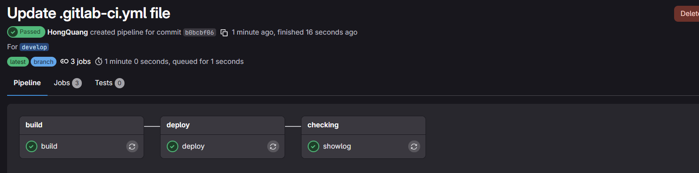

# CI/CD with Gitlab runner
This project is used to demonstrate how to establish CI/CD with Gitlab runner.

Presumming that you have already installed Gitlab runner in your own server

### Step 1: Connect and config gitlab-runner

Gitlab -> Choose your project -> Setting -> CI/CD -> Create project runner 


Follow the following steps to get gitlab url of the project and token to connect our own gitlab runner


**Connecting successfully**


Gitlab file config: "/etc/gitlab-runner/config.com"
```toml
concurrent = 4  # number of projects are allowed to run at the same time
check_interval = 0
connection_max_age = "15m0s"
shutdown_timeout = 0

[session_server]
  session_timeout = 1800

[[runners]]
  name = "lab-server"
  url = "https://gitlab.com"
  id = 1234124124
  token = "123123132"
  token_obtained_at = 2025-10-16T14:47:46Z
  token_expires_at = 0001-01-01T00:00:00Z
  executor = "shell"
  [runners.cache]
    MaxUploadedArchiveSize = 0
    [runners.cache.s3]    
    [runners.cache.gcs]
    [runners.cache.azure]
```

**Apply config command**
```bash
gitlab-runner run --working-directory /home/gitlab-runner --config /etc/gitlab-runner/config.toml 
# option "--service gitlab-runner --user gitlab-runner" allow process run background as a service 
```

### Step 2: Setup pipeline on gitlab

Create .gitlab-ci.yml file at the root of project
```yml
stages:
    - build
    - deploy
    - checking

build:
    stage: build
    script:
        - whoami
        - pwd
        - ls
    tags: 
        - lab-server # assign specific runner tag
``` 

**Result when successful**


After executing successfully, it will **pull source code** from gitlab **to gitlab runner host**. Then, whenever we modify source code at gitlab runner, pipeline **automatically update** gitlab source code on gitlab host.

### Step 3: Setup on runner server

**Create it's own project folder to mannage**

```script
mkdir /datas
mkdir /datas/shoeshop
visudo
```
**1 Setup user permission for gitlab runner**

Why we need to do this? Gitlab server will use "user :gitlab-runner" to run some commands that require sudo permission. So to let that happen, we grant minimal sudo commands such as: 

- **cp**: copy source in gitlab-runner to another location won't update automatically with gitlab host to run
- **chown** : allow project's user have control over the project
- **su $project-user**: execute command as owner of project

Use command **"sudo visudo"** to open /etc/sudoers

Config user permission for git runner that allow gitlab can execute pipeline with my server.

```yaml
 # User privilege specification
root    ALL=(ALL:ALL) ALL
gitlab-runner ALL=(ALL) NOPASSWD: /bin/cp*
gitlab-runner ALL=(ALL) NOPASSWD: /bin/chown*
gitlab-runner ALL=(ALL) NOPASSWD: /bin/su shoeshop*
```

### Step 4: complete pipeline

I'm going to explain the relationships, concepts in this file

We have 3 stages:

- build : use to build .jar file for this project
- deploy : copy file .jar to location that want to run.
- showlog : monitor log of running project.

Each of them include key-word:

- **stage**: name the stage 
- **script**: step by step command to run on gitlab-server
- **tags**: assign gitlab-runner for this pipeline
- **only**: when the pipeline is execute, in this case once we create new tag( like release verion of project)
- **variables**: *GIT_STRATEGY* is used indicate that it will clone( default) from gitlap to run for the current stage or keep the previous state then continue to run


**gitlab-ci.yml**
```yaml
variables:
    projectname: shoe-ShoppingCart
    version: 0.0.1-SNAPSHOT
    projectuser: shoeshop
    projectpath: /datas/$projectuser/

stages:
    - build
    - deploy
    - checking

build:
    stage: build
    variables:
        GIT_STRATEGY: clone
    script:
        - mvn install -DskipTests=true
    tags: 
        - lab-server
    only:
        - tags
deploy:
    stage: deploy
    variables:
        GIT_STRATEGY: none
    script:
        - sudo cp target/$projectname-$version.jar $projectpath
        - sudo chown -R $projectuser. $projectpath
        #kill process when there is existed process running project 
        - sudo su $projectuser -c "ps -ef | grep $projectname-$version.jar | grep -v grep | awk '{print \$2}' | xargs -r kill -9"
        - sudo su $projectuser -c "cd $projectpath; nohup java -jar $projectname-$version.jar > nohup.out 2>1 &" 
        - echo deploy success
        - > 
            if
    tags: 
        - lab-server
    only:
        - tags
showlog:
    stage: checking
    variables:
        GIT_STATEGY: none
    script:
        - sudo su $projectuser -c "cd $projectpath; tail -n 10000 nohup.out" 
    tags: 
        - lab-server
    only:
        - tags

```

Result:
Resutls all stage:



Project log:


---

Summarize:

I can initialize GitLab CI completely on my own. However, my lack of a strong Linux foundation means I spend more time and effort researching the necessary commands to get things working. I plan to focus on building up my Linux skills seriously from now on.

22/10/25