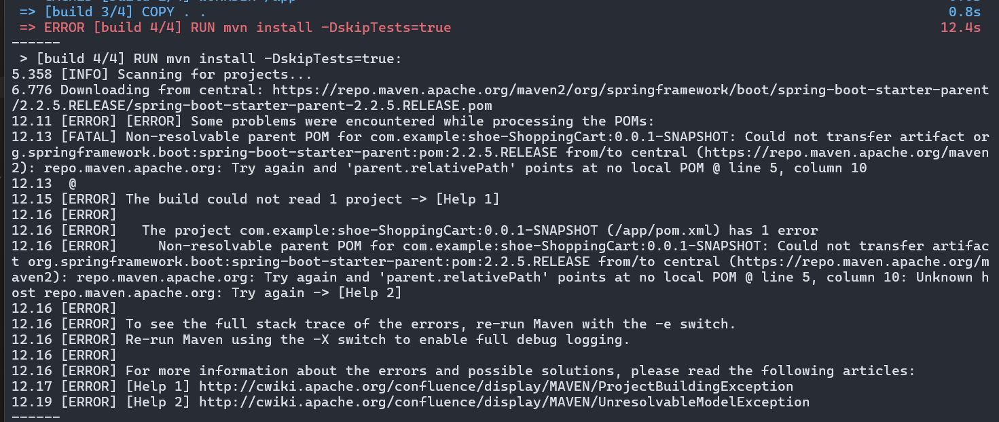

## 1 Deploy mindset
- none root user : default is user root
- base image : optimize image
- multipe stage : reduce size

Dockerfile note
1. correct image version for project
2. image from " official, verified, sponsored
3. base image - alpine - reduce size

## 2 Setup docker
### Prepare install script

```bash

sudo apt update
sudo apt install -y apt-transport-https ca-certificates curl software-properties-common

curl -fsSL https://download.docker.com/linux/ubuntu/gpg | sudo gpg --dearmor -o /usr/share/keyrings/docker-archive-keyring.gpg

echo "deb [signed-by=/usr/share/keyrings/docker-archive-keyring.gpg] https://download.docker.com/linux/ubuntu $(lsb_release -cs) stable" | sudo tee /etc/apt/sources.list.d/docker.list > /dev/null

sudo apt update
sudo apt install -y docker-ce
sudo systemctl start docker
sudo systemctl enable docker

sudo curl -L "https://github.com/docker/compose/releases/latest/download/docker-compose-$(uname -s)-$(uname -m)" -o /usr/local/bin/docker-compose

sudo chmod +x /usr/local/bin/docker-compose

docker --version

docker-compose --version

```
### Docker commands
create container and run background
```bash
docker run --name <container_name> -dp <host_port>:<container_port> <image_name>  
```
### Dockerfile commands
- FROM : pull image
- WORDIR: setup working directory
- COPY
- RUN
- ENV
- EXPOSE: define application port in container 
- CMD
- ENTRYPOINT
```Dockerfile
## build stage ##
FROM  maven:3.5.3-jdk-8-alpine as build
WORKDIR /app
COPY . .
RUN mvn install -DskipTests=true
## run stage ##
FROM amazoncorretto:8u472-alpine3.21-jre
COPY --from=build /app/target/shoe-ShoppingCart-0.0.1-SNAPSHOT.jar /run/shoe-ShoppingCart-0.0.1-SNAPSHOT.jar
EXPOSE 8080
ENTRYPOINT java -jar /run/shoe-ShoppingCart-0.0.1-SNAPSHOT.jar
```

Run command

```bash
 docker build -t shoeshop:v1
```
  

Custom server

```Dockerfile
#same as build stage ...

# Customer alpine server

FROM alpine:3.19
RUN adduser -D shoeshop
RUN apk add openjdk8
WORKDIR /run

COPY --from=build /app/target/shoe-ShoppingCart-0.0.1-SNAPSHOT.jar /run/shoe-ShoppingCart-0.0.1-SNAPSHOT.jar
RUN chown -R shoeshop:shoeshop /run
USER shoeshop
## continue ...

```

## 3 Build stage

I meet this error when run " docker build ".


I found out that docker is not able to connect to the internet by stimulating ping to maven server and it failed. So I config "/etc/docker/daemon.json". This config allow Docker to access the internet.

```json
{
  "dns": ["8.8.8.8", "1.1.1.1"]
}
```

After applying config, I start to build it again and it succeed


Finally, I ran Docker container from that image: 


I met error that cannot connect to website that is hosted. Later I figured out it was because application port didn't map port of container 
- 8080/tcp:  it provide port(informational) the app uses ( declare in Dockerfile)
- 0.0.0.0:9999->8082/tcp : **8082/tcp (Container Port)** This is the internal port inside the container where your application is actually listening, as defined by `server.port=8082`( spring boot)

```
PORTS
8080/tcp, 0.0.0.0:9999->8082/tcp, [::]:9999->8082/tcp

```

So I had to delete the previous container and run new one have port map with the app
```bash 
docker run --name shoeshop -dp 9999:8082 shoeshop:v1
```
