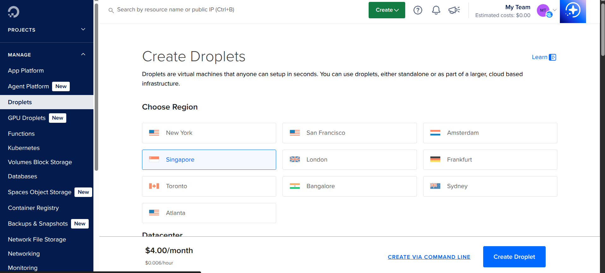
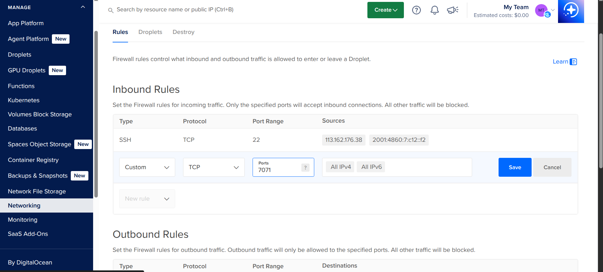

# Droplet
## 1 Create Droplet

1. Choose region
2. Choose OS 
3. Choose size
4. Setup authentication method (ssh or password)
5. Setup firewall



## Transfer file to VPS

```.bash
scp java-react-example-master.jar root@vps_ip:vps_location

```

## Expose running port 

Get into network tab -> edit droplet firewall -> add **inbound rules**


# Additional setup

```bash
apt install nettools
```

## Add user

Create new user ( not root ) for security, this allows user main using sudo command
```bash
adduser main
usermod -aG sudo main

```

## Add ssh key for new user
The previous ssh key is already used for root ( so initialize new one for different users)

```bash
su - main
cd ~
mkdir .ssh
sudo vim .ssh/authorized_keys

```
# Link
Setup ssh-key and connect using it ( without need a password)
[6 Connect SSH](../../../Linux/6%20Connect%20SSH.md)