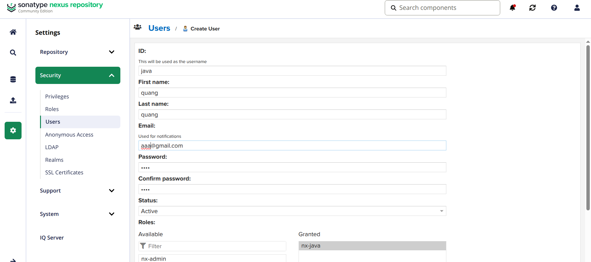

**Tags:** #tools

## Setup nexus

Checklist:
- install java
- download + untar Nexus package
- create Nexus user
- give user permission
- run Nexus with Nexus user
```bash
# install at folder /opt
wget nexus.tar
tar -zxvf  nexus.tar

```

- ls /opt/sonatype-work ( app info)
	- backup/ log
### Set nexus user for this service

```bash
chown -R nexus:nexus nexus.folder

# change user to run nexus
vi nexus/bin/nexus.rc
# ucomment run_as_user
/opt/nexus/bin/nexus start
netstat -lnpt

```


## Create user with upload/pull permission
1. Create roles with minimum privileges
2. Assign role to user




## Gradle publish artifacts

**build.gradle**

```json
plugins {  
    id 'java'  
    id 'org.springframework.boot' version '3.1.0-SNAPSHOT'  
    id 'io.spring.dependency-management' version '1.1.0'  
}  
  
group 'com.example'  
version '1.0-SNAPSHOT'  
sourceCompatibility = 17  

// command to publish to nexus: gradle publish
apply plugin: 'maven-publish'  
  
publishing {  
    publications {  
        maven(MavenPublication) {  
            artifact("build/libs/my-app-$version"+".jar"){  
                extension 'jar'  
            }  
        }    }  
    repositories {  
        maven {  
            name 'nexus'  
            url "http://localhost:8081/repository/maven-snapshots/"  
            allowInsecureProtocol = true  
            credentials {  
                username project.repoUser  
                password project.repoPassword  
            }  
        }   
    }
}
  
```

**gradle.properties : store gradle secrete**
```
repoUser = java  
repoPassword = 1234
```
**gradle.setting** (at the root project)
```
rootProject.name = 'my-app'
```


## Maven publish


/.m2/setting.xml (global config for maven)

```xml
<settings>
	<servers>
		<server>
			<id>nexus-snapshots</id>
			<username>java</username>
			<password>1234</password>
		</server>
	</servers>
</settings>
```

pom.xml ( make id same as setting.xml)
```xml
  
   <groupId>com.example</groupId>
    <artifactId>java-maven-app</artifactId>
    <version>1.1.0-SNAPSHOT</version>

    <build>
        <plugins>
            <plugin>
                <groupId>org.apache.maven.plugins</groupId>
                <artifactId>maven-compiler-plugin</artifactId>
                <version>3.11.0</version>
                <configuration>
                    <source>${maven.compiler.source}</source>
                    <target>${maven.compiler.target}</target>
                </configuration>
            </plugin>

            <plugin>
                <groupId>org.apache.maven.plugins</groupId>
                <artifactId>maven-deploy-plugin</artifactId>
                <version>3.1.1</version>
            </plugin>
        </plugins>
    </build>

    <distributionManagement>
        <snapshotRepository>
            <id>java-maven-snapshots</id>
            <url>http://localhost:8081/repository/maven-snapshots/</url>
        </snapshotRepository>
    </distributionManagement>
```

## Nexus API

Get all repo of a user

```bash
	curl -u user:pwd -X GET 'https://domain:8081/service/rest/v1/repositories'
```

## Blob storage
store config, assets of nexus

**Type of blob store**
1. File : system-based storage
2. S3 :  cloud-based storage( when nexus setup in aws)

**Notice**
1. Blob store can't be modify
2. Blob store used by a repo can't be deleted

**Need to decide**
1. How many blob stores create?
2. Which sizes
3. Which ones will use for which repos?
4. 
